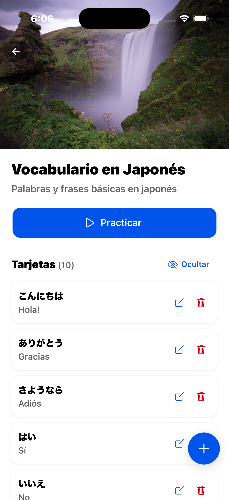
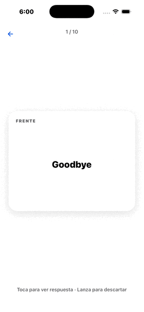
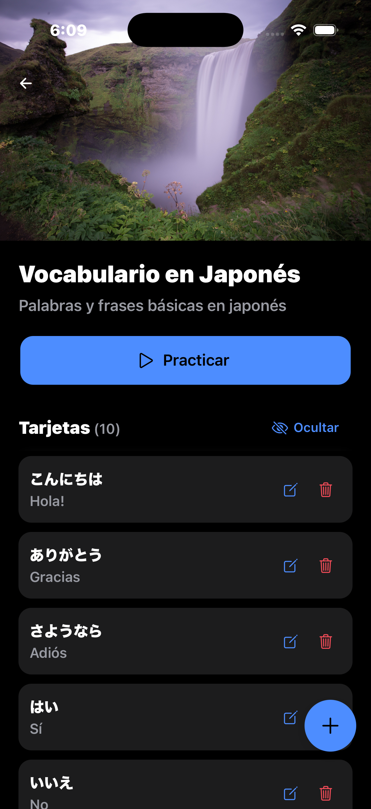

<h1 align="center">Acórdate</h1>

<p align="center">
  <strong>A flashcard app built to feel native — swipe, shake, and flip your way to fluency.</strong>
</p>

<p align="center">
  
  
  
  
  
</p>

---

<p align="center">
Acórdate is a cross-platform flashcard app that runs natively on iOS and Android (via Capacitor).
</p>

<p align="center">
  
</p>

<p align="center">
  <em>Simple local mobile flashcard application to foster learning and memorization of concepts.</em>
</p>

---

## Tech Stack

| Layer          | Technology                                                        |
| -------------- | ----------------------------------------------------------------- |
| UI Framework   | [Ionic React](https://ionicframework.com/) v8                     |
| Frontend       | React 19 + TypeScript 5.9                                         |
| Build          | Vite 5 + Ionic                                                    |
| Native Runtime | Capacitor v8 (iOS & Android)                                      |
| Storage        | `@capacitor-community/sqlite` (native) / `sql.js` + `jeep-sqlite` |
| Routing        | React Router v5 via `@ionic/react-router`                         |
| Testing        | Vitest (unit) + Cypress (e2e) — _none as of yet_                  |

---

## Features

- **Decks** — create, edit, delete, and view your practice decks.
<div align="center" width="320">



</div>

- **Cards** — front / back / description per card
- **Practice mode**

  - Physics-based swipe-to-dismiss with velocity fling
  - 3D flip on tap
  - Shake phone to discard current card
  - Stacked card peek (next card visible behind the current one)
  - Auto-reshuffle on deck completion

<div align="center">



</div>

- **Dark mode** — follows system preference via `@media (prefers-color-scheme: dark)`
<div align="center" width="320">



</div>

- **Mobile Native** — Meant for multiplatform use in iOS and Android. (SQLite doesn't work on web.)

## Getting Started

```bash
npm install

# Run in browser
npm run dev

# Build for production
npm run build

# Run unit tests
npm run test.unit

# Run e2e tests
npm run test.e2e
```

### Native (Capacitor)

```bash
# iOS
npx cap add ios && npx cap open ios

# Android
npx cap add android && npx cap open android
```

---

## Project Structure

```
src/
├── lib/ #Utilities
│   └── Database.ts #SQLite connection + all query functions
├── models/ #Model classes
│   ├── Card.ts
│   ├── Deck.ts
│   └── User.ts
├── pages/ #Views
│   ├── Onboarding.tsx
│   ├── Home.tsx
│   ├── AddDeck.tsx / ModifyDeck.tsx
│   ├── ViewDeck.tsx
│   ├── AddCard.tsx / ModifyCard.tsx
│   └── PracticeView.tsx
├── theme/ #Possible future variables
│   └── variables.css
└── App.tsx #Route definitions
```

---

<p align="center">Built with Ionic + React + Capacitor and an SQLite data store · Raúl Villarreal · 2026</p>
