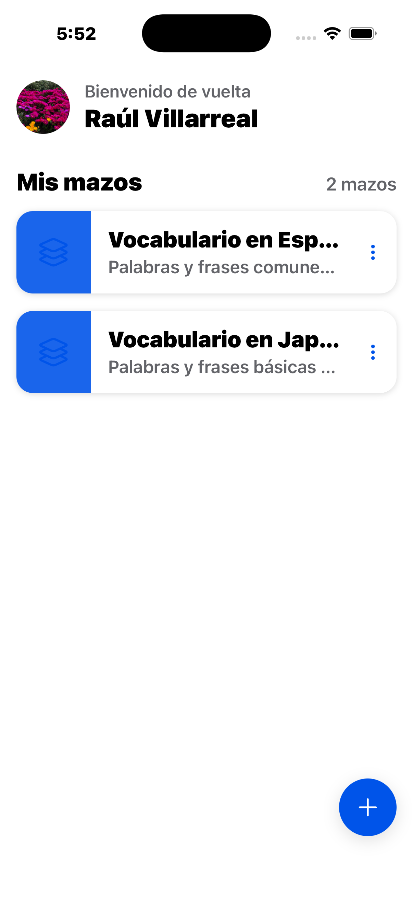
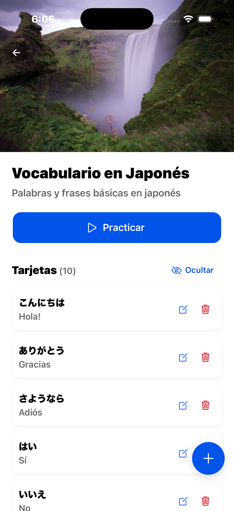
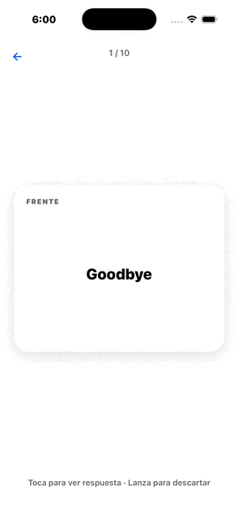
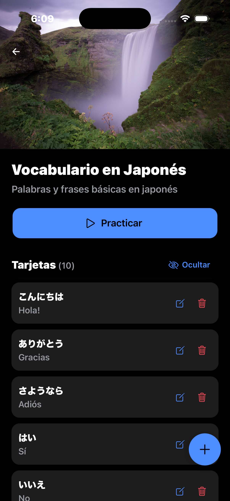

<h1 align="center">Acordate</h1>

<p align="center">
  <strong>A flashcard app built to feel native — swipe, shake, and flip your way to fluency.</strong>
</p>

<p align="center">
  
  
  
  
  
</p>

---

<p align="center">
Acordate is a cross-platform flashcard app that runs natively on iOS and Android (via Capacitor).
</p>

<p align="center">
  
</p>

<p align="center">
  <em>Simple local mobile flashcard application to foster learning and memorization of concepts.</em>
</p>

---

## Tech Stack

| Layer          | Technology                                                        |
| -------------- | ----------------------------------------------------------------- |
| UI Framework   | [Ionic React](https://ionicframework.com/) v8                     |
| Frontend       | React 19 + TypeScript 5.9                                         |
| Build          | Vite 5 + Ionic                                                    |
| Native Runtime | Capacitor v8 (iOS & Android)                                      |
| Storage        | `@capacitor-community/sqlite` (native) / `sql.js` + `jeep-sqlite` |
| Routing        | React Router v5 via `@ionic/react-router`                         |
| Testing        | Vitest (unit, 57 tests) + Cypress (e2e, 3 specs)                  |

---

## Features

- **Decks** — create, edit, delete, and view your practice decks.
<div align="center" width="320">



</div>

- **Cards** — front / back / description per card
- **Practice mode**

  - Physics-based swipe-to-dismiss with velocity fling
  - Shake phone to discard current card
  - Auto-reshuffle on deck completion

<div align="center">



</div>

- **Dark mode** — follows system preference via `@media (prefers-color-scheme: dark)`
<div align="center" width="320">



</div>

- **Mobile Native** — Meant for multiplatform use in iOS and Android. (SQLite doesn't work on web.)

## Getting Started

```bash
npm install

# Run in browser
npm run dev

# Build for production
npm run build

# Run unit tests once
npx vitest run

# Run unit tests in watch mode
npm run test.unit

# Run e2e tests (needs the dev server on port 5173 in another terminal)
npm run test.e2e
```

### Native (Capacitor)

```bash
# iOS
npx cap add ios && npx cap open ios

# Android
npx cap add android && npx cap open android
```

---

## Testing

Unit tests run on [Vitest](https://vitest.dev/) with the `jsdom` environment configured in `vite.config.ts`. They cover the logic layers only; the user flows are covered by the Cypress specs described below.

| File | Tests | What it checks |
| ---- | ----- | -------------- |
| `src/lib/SM2.test.ts` | 12 | New cards, the 1 → 6 → 15 → 38 day progression, the 10-year cap, lapses, `preview`, `stats`, `nextDueDate` and a corrupt due date |
| `src/lib/Database.test.ts` | 11 | Schema version reset, `insertCard` / `updateCard` progress fields, `getDueCards` ordering, `reviewCard`, `resetCardProgress`, `getDecksWithStats` |
| `src/lib/ProgressFormat.test.ts` | 17 | Interval labels, relative dates by calendar day, card due text, pending summary |
| `src/lib/Swipe.test.ts` | 16 | Tap vs throw, flight end point, landing side, pointer velocity, drag progress curve |
| `src/App.test.tsx` | 1 | The app renders |

Two conventions keep the tests deterministic:

- **Fixed clock.** `SM2` and the format helpers take the current date as a parameter, so every test uses the same `NOW` and the expected intervals and labels never depend on the day the suite runs.
- **No real database.** `Database.test.ts` replaces `@capacitor-community/sqlite` with `vi.mock` by a connection that records every statement and its parameters and returns per-table rows prepared by each test. The assertions check the SQL that would be sent, not a SQLite result. Because `Database.ts` caches its connection in a module variable, each test re-imports it with `vi.resetModules()`.

Run a single file with `npx vitest run src/lib/SM2.test.ts`.

### End-to-end (Cypress)

Three specs in `cypress/e2e/` drive the app in a real browser through the flows a new user goes through:

| Spec | Cases |
| ---- | ----- |
| `usuario.cy.ts` | "Empezar" stays disabled without a name; onboarding creates the user and lands on an empty Home |
| `mazo.cy.ts` | A deck without a name is rejected; a deck with name and description shows up in Home and opens empty; name alone is enough |
| `tarjeta.cy.ts` | Front and back are required; a card appears in the deck list; several cards accumulate |

Shared steps (`createUser`, `createDeck`, `openDeck`, `createCard`) live in `cypress/support/commands.ts`. The web database lives in memory and is never persisted, so every `cy.visit` starts from an empty database and the specs are isolated without extra cleanup.

```bash
npm run dev            # terminal 1: Vite on http://localhost:5173
npm run test.e2e       # terminal 2: headless run
npx cypress open       # or the interactive runner
```

The web build needs `public/assets/sql-wasm.wasm` to match the `sql.js` version compiled into `jeep-sqlite` (the 1.11.0 build for `jeep-sqlite` 2.8.0); a mismatch shows up as a `WebAssembly.instantiate()` error on the first screen.

---

## Project Structure

```
src/
├── lib/ #Utilities
│   ├── Database.ts #SQLite connection + all query functions
│   ├── Database.test.ts #Emitted SQL against a mocked connection
│   ├── SM2.ts #SM-2 algorithm class (no React / SQLite)
│   ├── SM2.test.ts
│   ├── ProgressFormat.ts #Spanish labels for intervals and due dates
│   ├── ProgressFormat.test.ts
│   ├── Swipe.ts #Throw gesture math for the practice view
│   └── Swipe.test.ts
├── models/ #Model classes
│   ├── Card.ts
│   ├── Deck.ts
│   ├── User.ts
│   └── progress/ #CardProgress and CardsProgressSummary
├── pages/ #Views
│   ├── Onboarding.tsx
│   ├── Home.tsx
│   ├── AddDeck.tsx / ModifyDeck.tsx
│   ├── ViewDeck.tsx
│   ├── AddCard.tsx / ModifyCard.tsx
│   ├── PracticeView.tsx
│   └── PracticeView.css #Glows, counters and reward animations
├── theme/ #Possible future variables
│   └── variables.css
└── App.tsx #Route definitions
```

---

<p align="center">Built with Ionic + React + Capacitor and an SQLite data store · Raúl Villarreal · 2026</p>
